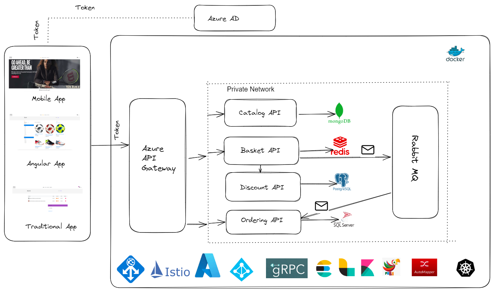
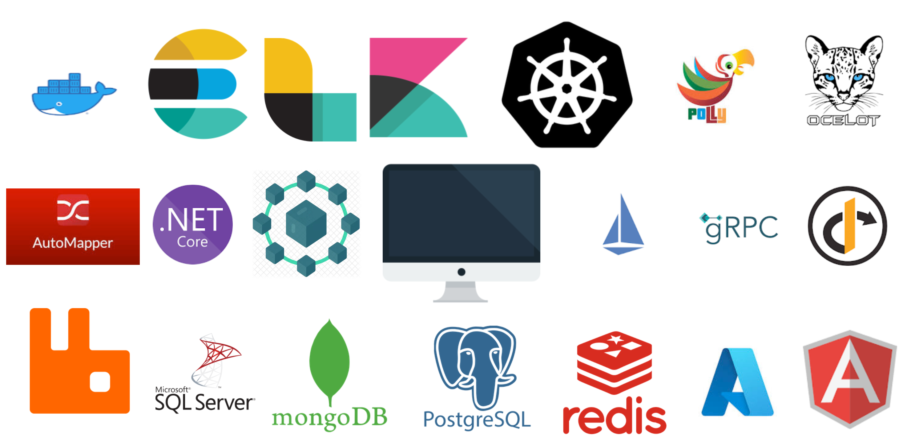

# 🚀 .NET Core Microservices with Clean Architecture

[]()
[]()
[]()
[]()

> Clean Architecture + Microservices với **.NET Core**, **Kubernetes**, **RabbitMQ**, **Redis**, **gRPC** và **Azure**.



---

## 📑 Mục lục

- [🎯 Features](#-features)
- [🛠 Tech Stack](#-tech-stack)
- [🏗 Architecture Overview](#-architecture-overview)
- [👨‍💻 Target Audience](#-target-audience)
- [📦 Prerequisites](#-prerequisites)
- [🚀 Getting Started](#-getting-started)

---

## 🎯 Features

- ✅ Secure Microservices with Azure AD
- ✅ Cross-cutting concerns (logging, monitoring, caching)
- ✅ API Gateway with **Ocelot** & **Nginx**
- ✅ Messaging with **RabbitMQ + gRPC**
- ✅ Deployment using **Docker + Kubernetes (AKS)**
- ✅ Istio Service Mesh for traffic management & observability
- ✅ Auto-scaling for High Availability
- ✅ Frontend with **Next.js**

---

## 🛠 Tech Stack

**Backend**

- .NET Core, gRPC, RabbitMQ, MassTransit, Dapr, Polly

**Frontend**

- React, Next.js

**Databases**

- SQL Server, MongoDB, PostgreSQL, Redis

**Infrastructure**

- Docker, Kubernetes, Istio, Helm, Ocelot, Nginx, Azure

**Observability**

- Elasticsearch, Logstash, Kibana (ELK Stack)

**Validation**

- FluentValidation



---

## 🏗 Architecture Overview

Microservices is a design pattern in which an application is divided into multiple independent modules that communicate through well-defined boundaries. This makes it easier to develop, test, deploy, and scale each part of the system.

Project about:

- Build & deploy microservices với **.NET Core**
- Using **Docker & Kubernetes** for container và orchestrate
- integration **Azure AD** cho auth
- Messaging với **RabbitMQ**
- Inter-service communication với **gRPC**
- Observability & traffic management với **Istio**
- Multi-database support (**SQL Server, MongoDB, PostgreSQL, Redis**)
- API Gateway by **Ocelot & Nginx**
- CI/CD với **Helm Charts** & auto-scaling

---

## 👨‍💻 Target 

Repo này hữu ích cho:

- Learn about micro services
- Architects design system **scalable** & **fault-tolerant**
- Learn more skill for growth my self

---

## 📦 Prerequisites

- Experience: **C#**, **Docker**, **Next.js**
- Understand basic: **Distributed Systems**

---

## 🚀 Getting Started

Clone repo:

```bash
git clone https://github.com/your-repo.git](https://github.com/nhatdayy/ecommerce-microservice
```
