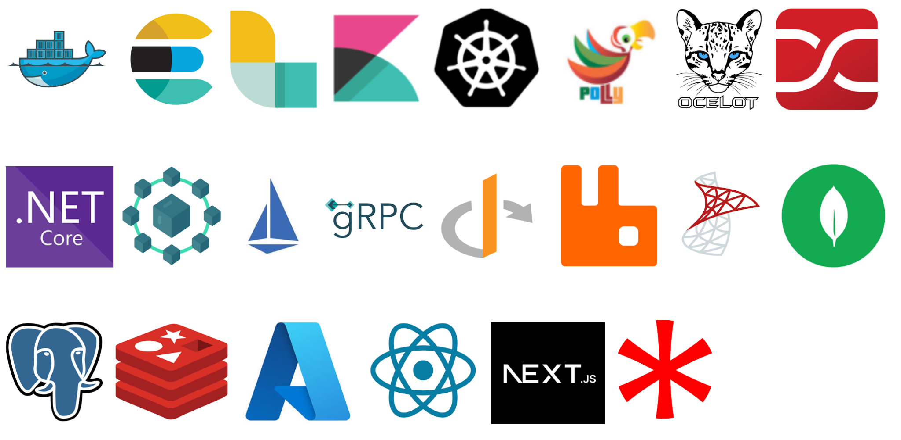

.Net Core Microservices using Clean Architecture Implementation
This repository contains a comprehensive implementation of Microservices architecture using the .NET Core platform along with modern tools and practices for building scalable, efficient, and robust distributed

Microservices are a design pattern in which applications are composed of independent modules that communicate with each other within well-defined boundaries. This architecture makes it easier to develop, test, and deploy isolated parts of an application.

This project demonstrates how to:

Build and deploy Microservices with .NET Core

Use Docker and Kubernetes for containerization and orchestration

Integrate Azure AD for authentication and authorization

Enable messaging with RabbitMQ

Implement efficient inter-service communication with gRPC

Manage traffic and observability with Istio Service Mesh

Use multiple data stores: SQL Server, MongoDB, PostgreSQL, Redis

Configure API gateways with Ocelot and Nginx

Deploy to Azure using Helm Charts

Enable Auto-scaling for high availability

Features

✅ Secure Microservices with Azure AD

✅ Implement cross-cutting concerns (logging, monitoring, caching, etc.)

✅ Versioning Microservices

✅ Build an Angular 15 frontend for Microservices

✅ Deploy to Kubernetes and AKS

Target Audience

This repository is useful for:

Developers who want to explore Microservices architecture in practice

Architects designing scalable and fault-tolerant systems

Teams looking for a reference implementation of modern .NET Microservices

Prerequisites

Basic understanding of C#, Docker, and Angular

Familiarity with distributed systems concepts

Tech Stack

Backend: .NET Core, gRPC, RabbitMQ, Redis

Frontend: Angular 15

Databases: SQL Server, MongoDB, PostgreSQL

Infrastructure: Docker, Kubernetes, Helm, Istio, Nginx, Ocelot, Azure

